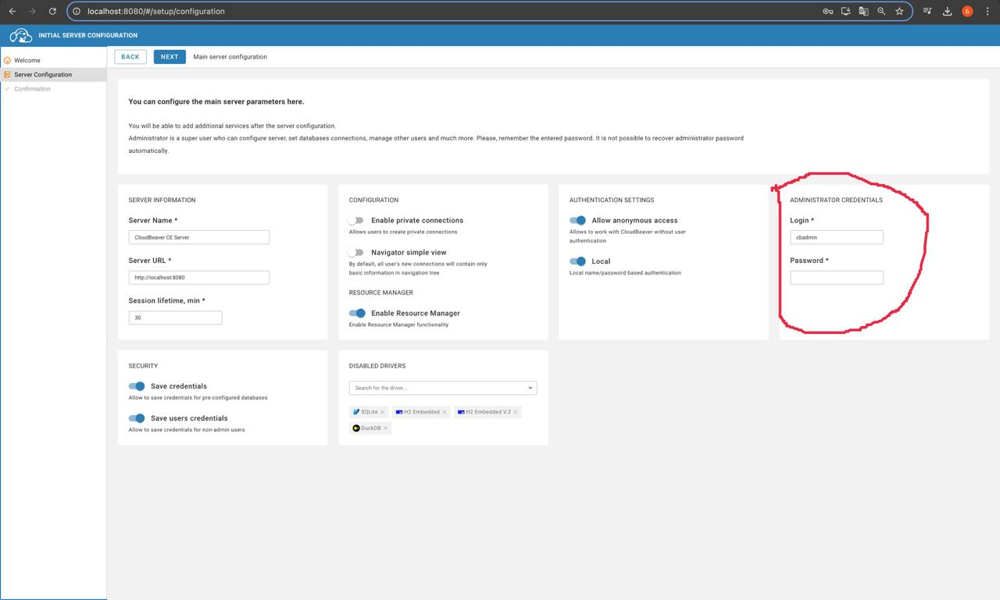
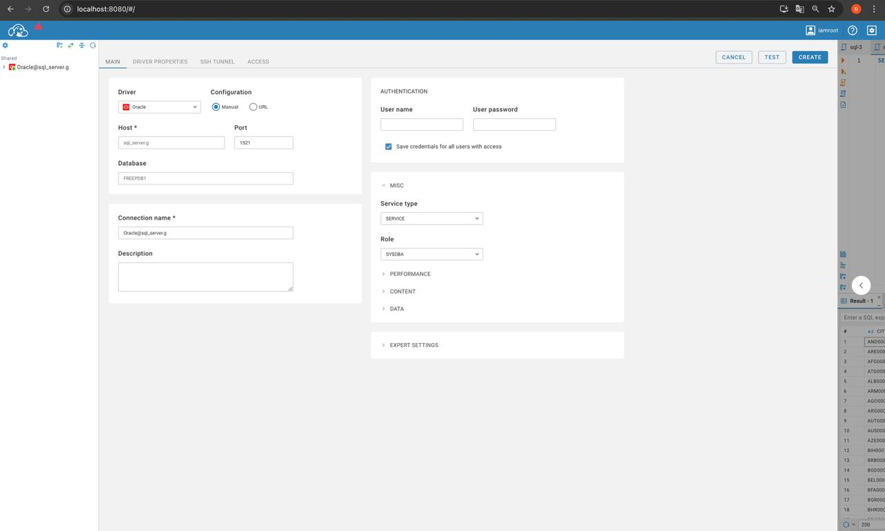

# Че почем

## Как поднять
Для запуска потребуется тачка с докером.

Рекомендуется взять тачку с юниксом, взять макбук или поднять убунту на виртуалке.
Под виндой я не запускал, поэтому работоспособность не гарантируется.

Клонируем репу к себе и заходим в папку:
```
git clone https://github.com/BorisKaryshev/oracle_db_on_linux.git
cd oracle_db_on_linux

mkdir data
chmod a+rw data

docker compose up
```

## Дефолтные логины и пароли
Пароль для админа (SYS) задается через переменную окружения в docker-compose.yaml.
Если не менять установленный, то будет - root.

Так же через переменные окружения создается юзер (root с паролем root).

## Как подключиться

В качестве смотрелки используется `CloudBeaver`.

Конектнутся к смотрелке можно в любом бразуере по адресу:
`https://localhost:8978`

Или, если запустили на ВМ, а открываем на хосте, то вместо `localhost` указываем *ip* ВМ.

    (ВМ - виртуальная машина)

Регаемся в смотрелке (введите любой логин, пароль, без них не запустится).


Дальше прокликиваем.

Теперь заходим в аккаунт смотрелки. Шестеренка в правом верхнем углу и Login.

Далее чтобы подключиться к БД нужно узнать *ip* контейнера с БД.
Сделать это можно следующей командой (работает на линуксе/маке):

```
docker inspect sql_server.g  | jq -r '.[].NetworkSettings.IPAddress'
```

Возвращаемя в смотрелку и Жмакаем на плюсик в квадрате в левом верхнем углу, и на *New connection*.

Заполняем так чтобы выглядело так же:


Только подставте свой *ip*, а не *172.17.0.7*.

Если хотите подключиться не как админ (SYS), то Role выберете не SYSDBA, а Normal.

## Доп инфа

Скрипты в папке example_tables при запуске контейнера с Oracle создают несколько таблиц, которые можно использовать для отладки своих скриптов.

    Но доступны они, пока что, только если заходить из под админа (SYS)
    и в качестве сервиса нужно указать FREE, а не FREEPDB1

Создаются следующие таблицы.

Про космос:
- metadata
- stars
- planets

Про сотрудников:
- departments
- employees

Про географию:
- regions
- countries
- cities
- currencies
- currencies_countries

---
По умолчанию, при перезапуске контейнера все данные теряются.
Чтобы это не происходило, они сохраняться в папке data.

Так что если хотите переподнять БД с нуля, то сотрите эту папку и создайте заново через:
```
sudo rm -r data
mkdir data
chmod a+rw data
```
